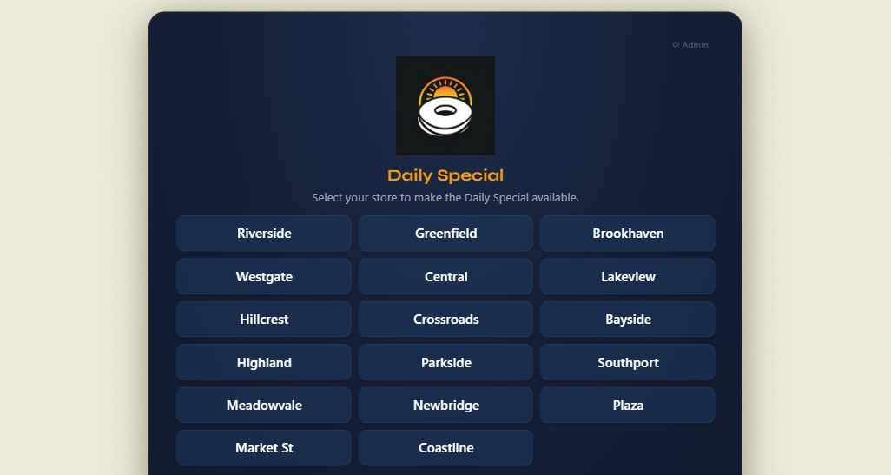
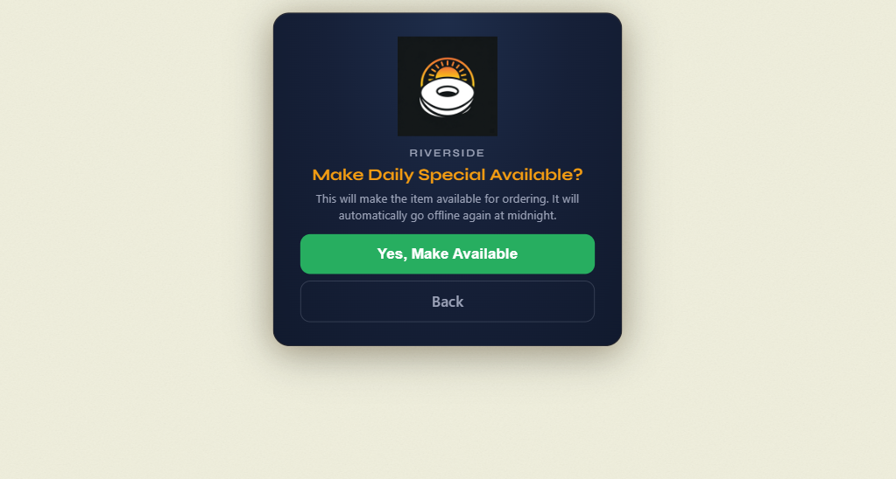
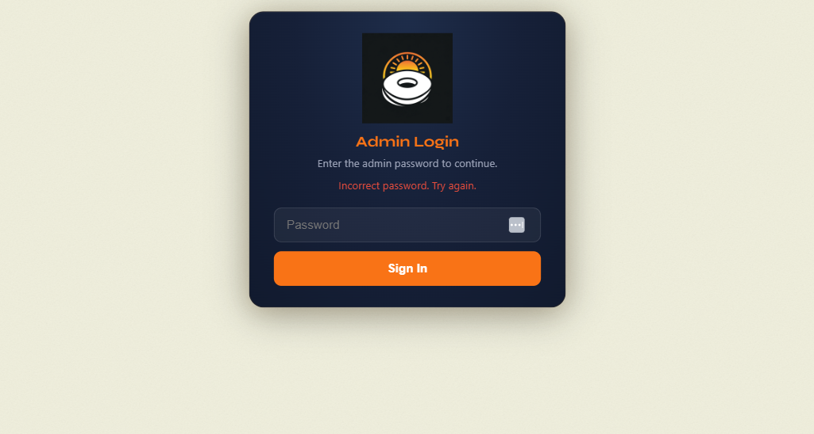
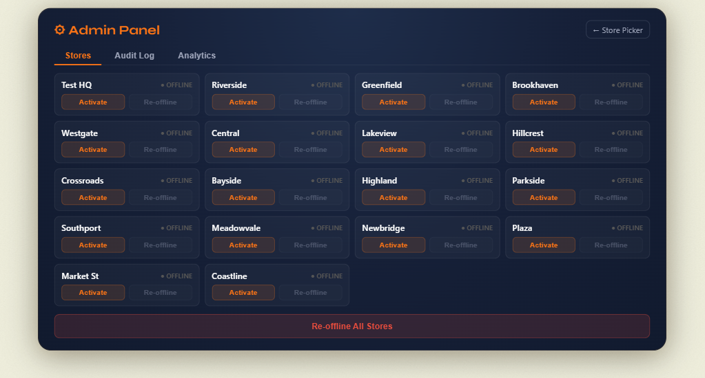
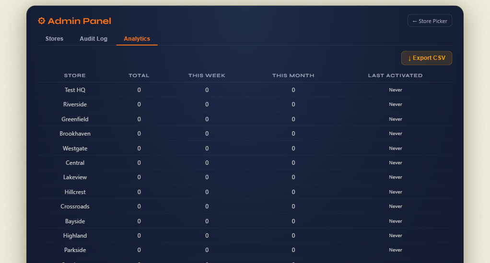

# POS Availability Toggle

A lightweight Cloudflare Worker that lets retail staff toggle a PLU item (a "daily special") between available and unavailable across a chain of stores on the [Redcat Polygon](https://redcat.com.au/) POS system - with a single URL, no installers, and zero ongoing infrastructure cost.

> **Note:** This is a sanitised portfolio version of an internal tool I built. Brand name ("Sunrise Donuts"), store names, and domain are placeholders; architecture and code are real.

## Screenshots

### Staff-facing flow (POS touchscreen)

<p align="center">
  
  &nbsp;
  
</p>
<p align="center"><em>Left: store picker - one POS button for every location. Right: two-step confirmation prevents accidental activation.</em></p>

### Admin dashboard

<p align="center">
  
  &nbsp;
  
  &nbsp;
  
</p>
<p align="center"><em>Password-gated admin area: session-cookie auth, per-store status + force-reoffline, audit log, and per-store activation analytics.</em></p>

## Why this exists

A quick-service donut chain ran a limited daily product that:

- Had to be switched to **available** by the first staff member in each morning
- Had to automatically switch to **unavailable** at close of trade, across every store
- Couldn't rely on the POS vendor's own scheduling (no EndDate field on offline rules, and availability changes didn't propagate to third-party delivery menus like Uber Eats without a specific trick)

The original solution was a **PyInstaller `.exe`** shipped to each POS machine that called the vendor API with embedded credentials. This had every problem you'd expect:

- Antivirus flagging the unsigned exe on new POS rollouts
- Credentials sitting on every till in the fleet
- Per-store rebuilds when anything changed
- No central audit trail

I replaced it with a single Cloudflare Worker. The POS now just has a browser shortcut.

## Architecture

```
┌────────────┐        ┌──────────────────────────┐        ┌─────────────────┐
│ POS (any)  │ HTTPS  │ Cloudflare Worker        │ REST   │ Redcat Polygon  │
│  browser   ├───────►│  /toggle  /admin  /cron  ├───────►│  POS API        │
└────────────┘        └────┬────────────┬────────┘        └─────────────────┘
                           │            │
                      ┌────▼───┐   ┌────▼──────┐
                      │ KV     │   │ Teams     │
                      │ (logs, │   │ webhook   │
                      │ rate   │   │ (alerts)  │
                      │ limit) │   └───────────┘
                      └────────┘
```

- **Single Worker** handles all stores. Staff open `/toggle`, pick their store, confirm, done.
- **Cron trigger** (`0 14 * * *` UTC = midnight AEST) cycles `DELETE → INSERT` offline rules for every store nightly, forcing a menu re-export.
- **KV** stores the audit log (90-day retention), per-store rate-limit cooldowns, and the branded logo.
- **Teams webhook** fires on every manual toggle and on cron failures.
- **Cloudflare Secrets** hold API credentials. Nothing lives on POS machines.

## The interesting bits

### The INSERT-before-DELETE trick

The Redcat API exposes `POST /pluavailabilityrules` (with an `Action: INSERT` field) and `DELETE /pluavailabilityrules` (by rule ID), but **no `GET` for existing rules by store + PLU**. That means there's no clean way to know the rule ID to delete.

The workaround:

1. `INSERT` the same rule - the API is idempotent here and returns the existing rule's ID
2. `DELETE` by that ID

```js
const ruleId = await insertRule(token, storeId, PLU_CODE); // returns existing ID
await deleteRule(token, ruleId);                           // brings item online
```

### The menu-export cycle

A plain `INSERT` of an offline rule that already exists is a no-op as far as Redcat is concerned - it does **not** push a fresh menu to third-party platforms (Uber Eats, DoorDash, etc). Cleaning up stale offline rules therefore isn't enough; the nightly cron has to `DELETE` **then** `INSERT` to trigger the export.

```js
async function reofflineStore(token, storeId) {
  const ruleId = await insertRule(token, storeId, PLU_CODE);
  await deleteRule(token, ruleId);           // forces export of "available"
  await insertRule(token, storeId, PLU_CODE); // immediately go offline again + export
}
```

### Confirmation page, not direct link

Early versions had `/toggle/:storeId` directly toggle on GET. A single misclick (or URL preview crawler, or browser prefetch) could activate a store's daily special by accident. The final version uses a two-step flow: GET renders a confirmation page, only POST executes.

### Rate limiting without a database

5-minute cooldown per store using Cloudflare KV with `expirationTtl`:

```js
await env.AUDIT_LOG.put(`cooldown:${storeId}`, "1", { expirationTtl: 300 });
```

No timers, no cleanup job, no Redis. The key just disappears.

## Tech stack

- **Cloudflare Workers** (serverless, edge)
- **Cloudflare KV** (audit logs, rate limiting, logo asset)
- **Cloudflare Cron Triggers** (nightly re-offline)
- **Cloudflare Secrets** (API credentials)
- **Vanilla HTML/CSS/JS** served by the Worker — no framework, no build step
- **Microsoft Teams webhooks** for alerting

**Infrastructure cost: $0/month** on the Cloudflare free tier. Current usage is well under the 100k requests/day and 1k KV writes/day limits.

## What's in the repo

| Path | What it does |
|---|---|
| `cloudflare-worker/src/worker.js` | Everything - routes, UI, API client, cron handler, audit logging, Teams alerts |
| `cloudflare-worker/wrangler.toml` | Worker config, cron schedule, KV binding |
| `cloudflare-worker/package.json` | Just `wrangler` as a dev dep |
| `logo.png` / `logo-256.png` | Brand logo (full-res + 256px web-optimised). The 256px version is base64-embedded in `worker.js` as a fallback so the worker renders correctly on fresh clones without KV setup. |
| `screenshots/` | UI screenshots referenced from this README |
| `CLAUDE.md` | Deeper engineering notes (API quirks, architecture decisions, gotchas) |

## Running it yourself

```bash
cd cloudflare-worker
npm install
npx wrangler kv namespace create AUDIT_LOG         # copy the ID into wrangler.toml
npx wrangler secret put REDCAT_USERNAME
npx wrangler secret put REDCAT_PASSWORD
npx wrangler secret put ADMIN_KEY
npx wrangler secret put TEAMS_WEBHOOK              # optional
npx wrangler deploy
```

Then upload your logo (optional - falls back to the embedded one if skipped):

```bash
npx wrangler kv key put --namespace-id=<YOUR_KV_ID> "logo.png" --path="../logo-256.png"
```

## What I'd do differently

- **TypeScript** - 1,400 lines of vanilla JS was comfortable but the types for the Redcat response bodies would've saved a couple of debugging sessions.
- **Split the worker** - the single `worker.js` bundles routing, HTML, API client, and cron handler. It's fine at this size but splitting `routes/`, `api/`, `views/` would scale better.
- **Durable Objects** for the rate limiter instead of KV, if toggle frequency ever grew enough that KV's eventual consistency mattered.
- **Open-telemetry to a hosted backend** for request tracing, instead of only logging to KV.

## License

MIT - see `LICENSE`.
